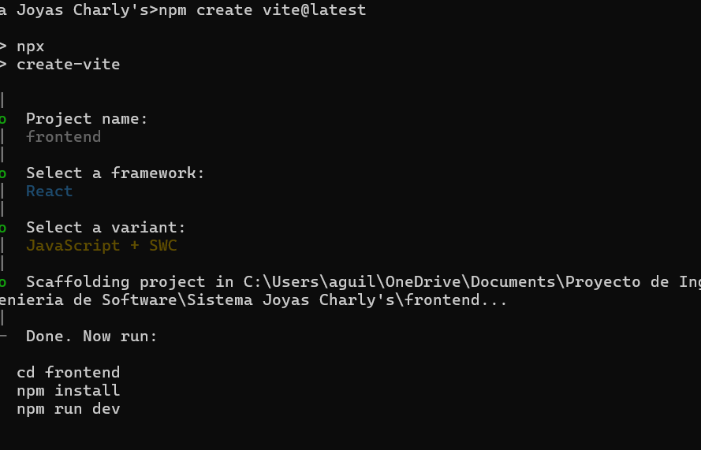

# Proyecto_Ingenieria_de_Software
Este es un Proyecto para la clase de Ingeniería de Software UNAH III PAC 2025

# Joyeria - Sistema (Frontend + Backend)

Este repositorio contiene un sistema para una joyería, desarrollado con **React + Vite** en el frontend y **Node.js + Express** en el backend, utilizando **SQL Server** como base de datos.

---

## ✅ Requisitos

- Node.js v22+  
- Git  
- SQL Server accesible (local o remoto)  
- Editor de código (VSCode recomendado)  

---

## 🚀 Instalación y ejecución

### 1. Clonar el repositorio
- git clone https://github.com/MDCardenas/Proyecto_Ingenieria_de_Software.git
- cd Sistema Joyas Charly's

### 2. Backend
- cd backend
- cp .env.example .env              ----> Rellenar con tus credenciales de SQL Server
- npm install
- npm run dev                   ----> Levanta backend en http://localhost:3001

### 3. Frontend
- cd ../frontend
- cp .env.example .env          ----> Opcional, para ajustar VITE_API_URL
- npm install
- npm install axios             ----> Instalación global de axios para todos
- npm run dev                   ----> Levanta frontend (ej: http://localhost:5173)

Nota: Puedes abrir dos terminales para correr backend y frontend simultáneamente, o configurar concurrently si quieres un solo comando (lo que ya esta hecho en el package.json de la raiz del proyecto).

### 4. Variables de entorno
backend/.env

- PORT=3001
- DB_USER=sa
- DB_PASSWORD=TuPassword
- DB_SERVER=localhost
- DB_PORT=1433
- DB_DATABASE=JoyeriaDB

frontend/.env

- VITE_API_URL=http://localhost:3001/api

### Scripts útiles

- cd backend && npm run dev ----> Backend en desarrollo con nodemon

- cd frontend && npm run dev ----> Frontend con Vite

- Opcional: npm run dev ----> desde la raíz si se configura concurrently

### Dependencias importantes

- React + Vite
- react-router-dom
- axios (para llamadas a la API)
- express
- mssql (SQL Server)
- cors
- dotenv
- nodemon (dev)

### Elección de React, JavaScript + SWC, y el nombre del proyecto.

### Siguientes pasos

- Implementar endpoints en backend/src/routes/
- Consumirlos desde frontend/src/services/ usando axios
- Agregar autenticación y roles si se requiere
- Llenar las páginas (Login, Ventas, Facturación, Cotizaciones, Inventario, Órdenes, Contabilidad, Usuarios)
- Crear scripts SQL para la base de datos (tablas y datos iniciales)